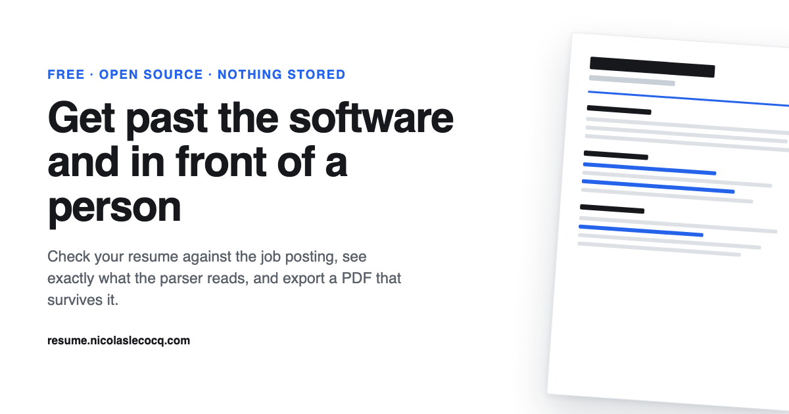

# ATS Resume Checker

A free resume checker and builder that runs entirely in the browser. It reads the resume you already
have, compares it against a job posting, shows you the plain text a parser extracts from your
document, and prints a PDF that screening software reads correctly.

**Live: [resume.nicolaslecocq.com](https://resume.nicolaslecocq.com/)**



[](LICENSE)
[](https://astro.build)
[](https://tailwindcss.com)
[](https://developers.cloudflare.com/workers/static-assets/)

---

## Why this exists

An applicant tracking system extracts the text from your file, sorts it into fields such as employer,
job title and dates, then scores those fields against the requisition. Most resumes fail at the
sorting step rather than the scoring step, and the usual reason is a two column layout with a skills
sidebar: the extractor reads the page in one pass and interleaves the columns, so your job title
ends up filed under your employer. The rejection email arrives before a person has read a line, and
it never tells you which step failed.

This tool shows you the step that failed.

## What it does

| | |
|---|---|
| **Parser view** | Renders the plain text an extractor pulls out of your document, next to the document itself. If a heading or a date looks wrong here, it is wrong in the employer's system. |
| **Posting match** | Paste the job description. The checker separates required from preferred terms using the posting's own headings and cues, then reports how many of the required ones your resume already contains. |
| **PDF import** | Drop in your current resume. The text is extracted with pdf.js inside your tab and sorted into fields you then correct. |
| **JSON round trip** | Export your resume as JSON and import it next time, so a new application costs you the posting step and nothing else. |
| **Three templates** | All single column with standard headings, because that is what parses. They differ in density, not in structure. |
| **Real text layer** | Printing goes through the browser, so the PDF keeps a text layer. A rasterised PDF is invisible to every parser. |

## What it will not do

It does not write hidden keywords in white text, and that is a deliberate decision rather than a
missing feature.

Parsers strip styling and read the raw text layer, so a hidden block lands in the middle of the
recruiter's screen looking exactly like what it is. Screening platforms flag the pattern, and a
flagged application can be rejected automatically with a fraud marker attached to the candidate
record, which follows the applicant across every future role at that company. The same applies to
hidden instructions aimed at an AI reader.

Putting the same words in visibly, inside the summary and inside real bullets, scores identically
and survives a human reading it. That is what the posting step does. When a required term is missing,
it is reported as missing, and the person decides whether it is true of them before it is added.

## Privacy

There is no database, no account, no analytics cookie and no server that receives your file. Your
resume, your photo and the posting you paste are held in the browser tab and in `sessionStorage`,
which the browser clears when the tab closes. The JSON export is the only copy that outlives the
session, which is why it exists.

The site is a static bundle. Nothing on the page can send your data anywhere, and you can verify that
by reading `src/scripts/` or by opening the network tab.

## Running it locally

```bash
git clone https://github.com/DigiHold/ats-resume-checker.git
cd ats-resume-checker
npm install
npm run dev          # http://localhost:4321
```

```bash
npm run build        # static bundle into dist/
npm run preview      # serve the built bundle
npm run deploy       # build, then wrangler deploy
```

## Deploying your own copy

The output is a folder of static files, so any host works. The repository is set up for Cloudflare
Workers with static assets, where static asset requests are not billed.

```bash
npx wrangler login
npx wrangler deploy
```

Then point a hostname at the Worker: **Cloudflare dashboard → Workers & Pages → your worker →
Settings → Domains & Routes → Add → Custom domain**. Cloudflare creates the DNS record and issues the
certificate itself, so there is nothing to configure by hand as long as the zone is on Cloudflare.

Change `name` in `wrangler.jsonc` and `site` in `astro.config.mjs` to your own before deploying.

## How it is built

```
src/
  pages/index.astro     the whole page: markup, copy, JSON-LD schema
  styles/global.css     Tailwind v4 theme tokens and the component layer
  styles/sheet.css      the resume sheet and the print rules, plain CSS on purpose
  scripts/app.ts        wizard state, forms, import and export, printing
  scripts/parse.ts      pdf.js text extraction and the heuristics that sort it into fields
  scripts/keywords.ts   posting analysis, required against preferred, the match score
  scripts/render.ts     resume data to sheet HTML, and the parser text approximation
  scripts/types.ts      the resume model and the import normaliser
```

Two notes on the choices, since they look inconsistent at first glance:

The resume sheet is styled in plain CSS rather than Tailwind because its markup is generated as an
HTML string at runtime, where Tailwind's scanner cannot see the class names. The same reasoning
explains the small component layer in `global.css`, while static markup uses utilities directly.

pdf.js is loaded through a dynamic import, so the 400 KB library is fetched only when someone
actually drops a PDF in. The initial page ships around 32 KB of JavaScript.

## Contributing

Issues and pull requests are welcome. Two things to know before you open one:

The extraction heuristics in `parse.ts` are the weakest area, and a failing real world resume is the
most useful bug report there is. Attach the PDF only if you are comfortable making it public, or
describe the layout and paste the text `pdftotext -layout` gives you.

Pull requests that add hidden text, invisible keywords or prompt injection aimed at AI screeners will
be closed. The reasoning is in the section above.

## Licence

MIT. See [LICENSE](LICENSE).

Built by [Nicolas Lecocq](https://nicolaslecocq.com/).
